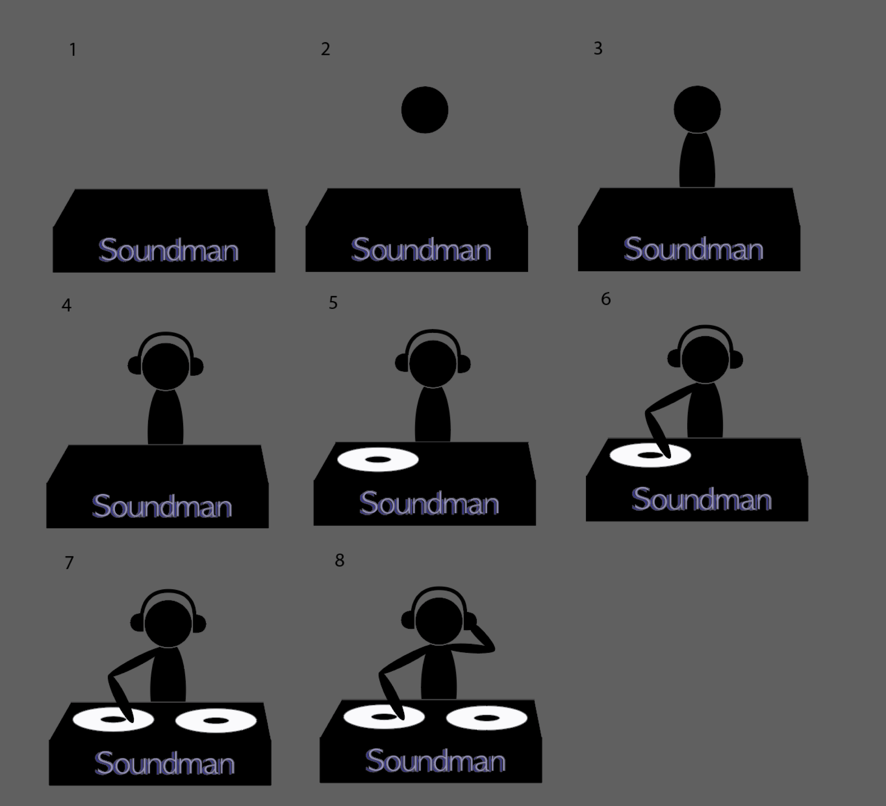

# READ ME: 
# Soundman - A Music-Themed Hangman Game
## Overview
Soundman reinvents the classic hangman game by blending it with musical elements, integrating entertainment and music. 
This game challenges players to guess a hidden artist offering a unique blend of trivia and music discovery. 
## Gameplay
Starting a New Game: Each round kicks off with a mystery artist from the genre listed. 
Guessing Letters: Players guess and select letters from the alphabet to uncover the hidden artist name.
Uncovering the Artist: Correct guesses reveal the corresponding letters in the artist's name, moving players closer to victory.
## Progressive Soundman Drawing
Limited Incorrect Guesses: Players are given either 7-8 missed attempts to solve the puzzle. 
Missed guesses lead to the progressive drawing of the Soundman figure.
Victory Conditions: Success is achieved when players correctly identify the song title before the soundman figure is fully drawn.

# soundman
